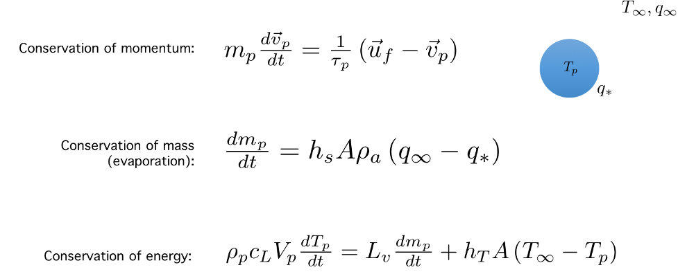
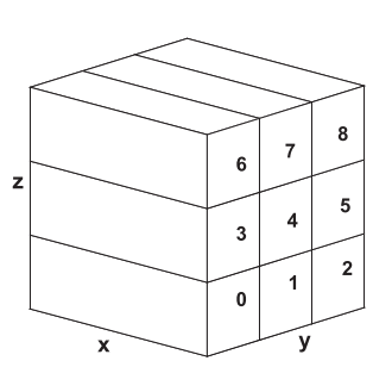
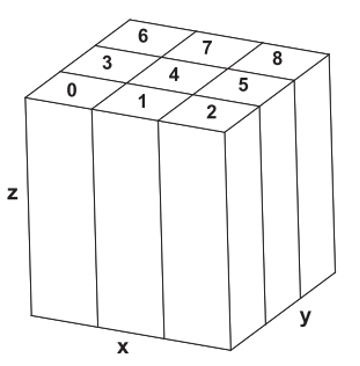

# Reference Overview
This provides an overview of the governing equations used in NTLP, how their
numerics are implemented in the code, and how the domain decomposition for the
fluid and particle simulations are related.

# Governing Equations
At its core the code is an incompressible Navier-Stokes solver on a Cartesian
grid.  Thus at each grid point the code by default solves the conservation of
mass, momentum, energy, and scalar for three velocity components ($u$, $v$,
$w$), temperature ($T$), and specific humidity ($q$).  It is easy to add
additional variables which obey the scalar transport equation. The governing
equations are:


$\nu_{a}$ is the kinematic viscosity and $\rho_{a}$ is the density of the
Eulerian fluid. $c_{p}$ is the specific heat of the Eulerian fluid at constant
pressure, $k$ is the heat conductivity of the Eulerian fluid, and $\Gamma$ is
the diffusivity of the scalar within the Eulerian fluid.  The horizontal
directions (x and y) are periodic in space, and thus use spectral-based
derivatives computed with a fast Fourier transform (FFT) package. The vertical
direction (z) is discretized using second-order finite differences.

At the same time, mass, momentum, and energy conservation are also applied to
Lagrangian particles which are transported independently from the grid.  Each
droplet is governed by the following equations for its velocity $v_{p}$,
temperature $T_{p}$, and mass $m_{p}$:



$m_{p}$ is the droplet mass, $V_{p}$ is the droplet volume, $c_{L}$ is the
specific heat of the liquid droplet, $\rho_{p}$ is the density of the droplet,
$L_{v}$ is the latent heat of vaporization, $h_{T}$ is the thermal convection
coefficient, $h_{s}$ is the mass convection coefficient, $A$ is the droplet
surface area, $\tau_{p}$ is the particle acceleration timescale, and $u_{f}$,
$T_{\infty}$, and $q_{\infty}$ are the surrounding Eulerian fluid velocity,
temperature, and humidity interpolated to the particle location.  More details
are found in Helgans and Richter, IJMF, 2016.

# Numerics and Code
All quantities are integrated in time using a 3rd order Runge-Kutta time
stepping scheme.  Note that the equations look slightly different in the code
since they can be further re-normalized and nondimensionalized -- for example
it’s the droplet radius and not the mass which is actually solved for in the
code.  Two-way coupling is enforced by taking the momentum, heat, and moisture
released/absorbed by each droplet and projecting it back onto the surrounding
fluid.  This results in additional source terms in the Eulerian equations above
(not shown).  In the code, the momentum feedback source field is called
`partsrc(:, :, :)`, the energy coupling fields are called `partTsrc(:, :, :)`
and `partTEsrc(:, :, :)`, and the humidity coupling field is called `partHsrc(:, :, :)`.

The main program in the code contains the basic skeleton for time stepping. Its
basic structure is as follows:

```
Initialization routines (restart, setup, particle_init, etc.)

For i=0 to total number of time steps

    For RK stage = 1 to 3
        Call statistics, boundary condition, and I/O subroutines

        “call comp1” -- computes the RHS of the Eulerian equations
        “call comp_p” -- Solves the pressure Poisson equation
        “call comp2” -- corrects the velocity field based on pressure

        “call particle_update_rk3” -- update all particle information

    End RK loop
End time step loop
```

The code is written using MPI for parallelization.  The domain decomposition for
the Cartesian computational domain on 9 CPUs looks like (more details are in
Sullivan and Patton, JAS, 2011):



Thus each CPU has the entire x-extent of the Eulerian information and only a
portion of the y and z.  The particles, however, are distributed according to a
different decomposition:



Since particles cluster near the top and bottom of the domain, this is required
to achieve the same number of particles on each CPU.  For the
velocity/temperature interpolation routine and again for the source term
feedback, a data transpose must be performed across CPUs.  (for example see the
`ztox_trans()` subroutine in the code).
