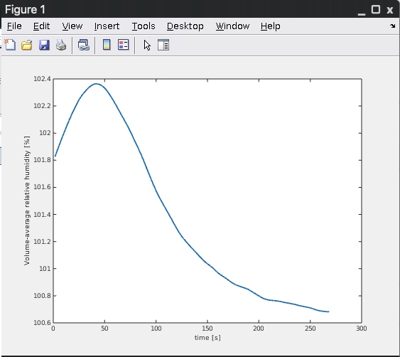
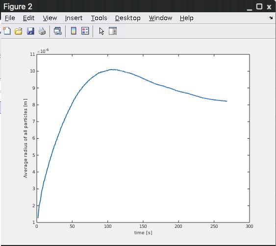
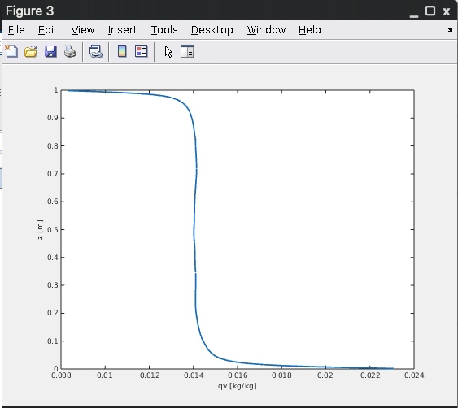
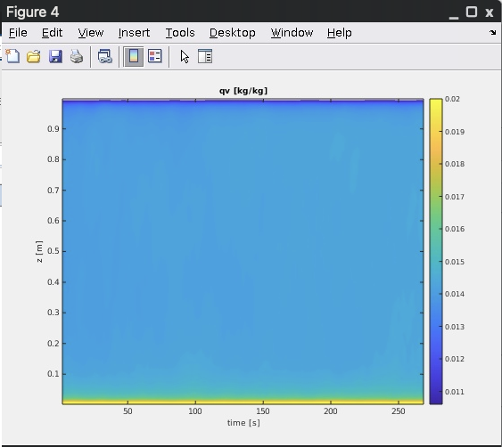
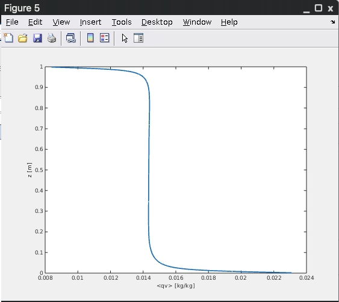
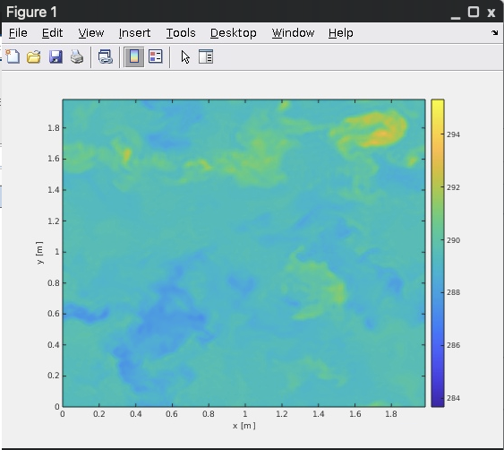
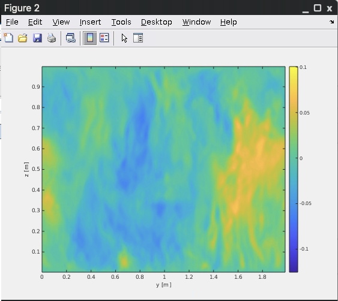
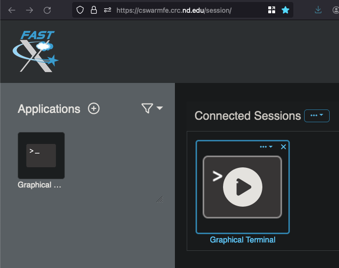

# Tutorial Overview
This tutorial demonstrates how to investigate NTLP's outputs when written in
NetCDF, as well as creates examples of common visualizations when analyzing the
output of a simulation.  This tutorial assumes you have [setup and run NTLP for
the pi chamber test case](./setup-and-run.md).

***NOTE:*** This tutorial is heavily reliant on Notre Dame resources.  External
users need to adjust how they launch graphical MATLAB sessions and the path to
their pi chamber simulation data.

# Instructions

## Connect to Notre Dame
Connect to the Notre Dame network via VPN if you're off campus.

## Launch a FastX Connection
[FastX is the CRC-supported software](https://docs.crc.nd.edu/general_pages/f/fastx.html)
that lets you access login nodes' graphical desktops so you can visualize data
with MATLAB.  This is faster than forwarding X11 connections and does not
require additional software to be installed on your local machine.

Open a web browser and visit https://cswarmfe.crc.nd.edu/.  Enter your netID and
password to log in.  Double click the terminal icon on the left side of the
screen to start a graphical desktop on `cswarmfe`.

Unfortunately the browser version of FastX does not support copying and pasting
things between your local system and cswarmfe.  If you are typing commands by
hand, you may skip this step.  Otherwise, open this file in an xterm (or an
editor of your choosing) so its commands can be copied and pasted into the
terminal and MATLAB.

```shell
$ xterm -e less ~/code/NTLP/documentation/tutorials/post-processing-simulations.md
```

## Launch MATLAB
Launch MATLAB 2023b so you can investigate the contents of the NetCDF files
written when running the pi chamber test case in NTLP.

```shell
$ module load matlab/2023b
$ cd /scratch365/${USER}/pi_chamber
$ matlab &
```

## Set the MATLAB Environment
Prepare the MATLAB environment and change into the pi chamber test case's output
directory.  Add the paths to the NTLP post-processing code to MATLAB so the
scripts used below can be located:

```matlab
>>> addpath( [getenv('HOME'), '/NTLP/postprocessing'] )
```

Now change into the output directory:

```matlab
>>> cd( ['/scratch365/', getenv('USER'), '/pi_chamber'] )
```

## Inspecting the History File
Among the data files written to the output directory, there is a file called
`history.nc` which is a NetCDF file containing data at every ihst time steps
(set to 50 in the pi chamber’s `params.in`).  This file contains two types of
data:

- Quantities which can be plotted as a function of time, including the surface
  stressed case, the total number of particles, etc
- Horizontally-averaged profiles which can be plotted as a function of z at
  every time

You can see the contents of the file, as well as the size and names of all of
the variables, with the following:

```matlab
>>> ncdisp( 'history.nc' )
Source:
           /scratch365/bsmith/pi_chamber/history.nc
Format:
           classic
Dimensions:
           time = 200   (UNLIMITED)
           zu   = 128
           zw   = 129
           nscl = 2
Variables:
    time
           Size:       200x1
           Dimensions: time
           Datatype:   single
           Attributes:
                       title = 'Simulation time'
    dt
           Size:       200x1
           Dimensions: time
           Datatype:   single
           Attributes:
                       title = 'Model time step'
    utau
           Size:       200x1
           Dimensions: time
           Datatype:   single
           Attributes:
                       title = 'Friction velocity ustar'
...
```

This `history.nc` file was generated from 10,000 time steps of the pi chamber
test case which writes output every 50 time steps, thus the time dimension
is 200.  All time-dependent variables (`time`, `dt`, etc) have this length along
their time dimension.

## Interactive Exploration
The data written may be explored interactively.  For example, the following plots
the time step as a function of time:

```matlab
>>> time = ncread( 'history.nc', 'time' );
>>> dt = ncread( 'history.nc', 'dt' );
>>> plot( time, dt )
```


## Example Analysis

Run the history file post-processing example script, `history_postprocessing.m`,
to generate five plots representing:

- Volume-averaged relative humidity vs time
- Average radius of all particles vs time
- Water vapor mixing ratio vs time (animation of line plots)
- Water vapor mixing ratio vs time (contour plot)
- Time-averaged water vapor mixing ratio vs time







Run the visualization post-processing example script, `viz_postprocessing.m`, to
generate two animations:

- XY-slice of potential temperature
- YZ-slice of vertical velocity

NOTE: This will close the animations from the previous step!

```matlab
>>> viz_postprocessing
```




## Cleanup and Quit
Once you are done investigating the contents of the NetCDF files on disk, close
MATLAB and the FastX session:

```matlab
>>> quit
```

If you're using FastX, Go to the FastX session window (or tab) and terminate the
graphical desktop.  Click the the connected session's icon to make an “x” appear
in the upper-right corner.  Click the "x" and click “Terminate” to end the
session.



# Summary
In this tutorial you launched MATLAB to explore the contents of a NTLP
simulation and visualized a handful of common simulation metrics, both as static
figures as well as animations evolving in time.
